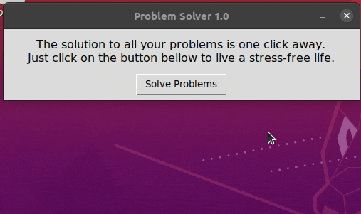

# ProblemSolver 1.0

This application will solve **ALL** your problems. Just run the Problem Solver 1.0 and live a stress-free life.

## Requirements

This project was developed in **python 3**. Additionally, it uses **tkinter**, a standard python library for building GUI. In order to install tkinter, execute the following command:

```bash
sudo apt install python3-tk
```

## Installation

No additional installation is required.

## Usage

Start ProblemSolver 1.0 by executing the problem_solver.py script. This will open the window below.


By clicking on the "Solve Problems" button, your problems will immediately start to be solved. 

A popup showing the status of the problem solving process will open, as shown below.



In the unlikely case of still having problems after running ProblemSolver 1.0, click on the "I still have problems :(" button to fix those stubborn issues. 

Otherwise, click on "Yay!" and go **enjoy your life!**

## Motivation

This development of this project was motivated by ~~a crappy life full of problems~~ the curiosity on creating GUI's using tkinter package.